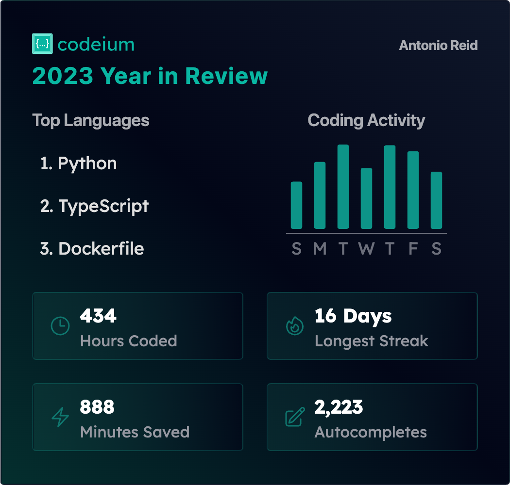

  

    <a href="https://github.com/AReid987/career-compass">
      
      AReid987/career-compass
    </a>
    
    
    
    
    
    
    
    
    
    
    
    
    
    
    
    
    
    
  

<!-- <svg fill="none" viewBox="0 0 600 400" width="100%" height="100%" xmlns="http://www.w3.org/2000/svg">
<foreignObject width="100%" height="100%">

  

    <h2 style="border: solid 2px rgba(0, 0, 0, 0.4); padding: 1rem; border-radius: 12px; box-shadow: 0 8px 16px 0 rgba(0,0,0,0.2);">
      Hi, I'm Antonio
    

      👋
    

    </h2>
    <ul align="left">
      <li>
        💻 Software Engineer
      </li>
      <li>
        📚 Lifelong Learner
      </li>
    </ul>
    <h1>Career Compass</h1>
    
<em>Navigate to your next role with AI</em>

    

      <a href="https://github.com/AReid987/career-compass" style="color:#000">
        
        AReid987/career-compass
      </a>
    

    

      
    

    <table>
      <tr>
        <td>
          
        </td>
        <td>
          
        </td>
        <td>
          
        </td>
      </tr>
      <tr>
        <td>
          
        </td>
      </tr>
    </table>

  

</foreignObject>
</svg>

## Tech Stack

  
|49 Tools used|02/21/24  Report generated|
|------|------|

##  Languages (3)

<table><tr>
  <td align='center'>
  
   
  <a href="http://www.typescriptlang.org">TypeScript</a>
   
  
</td>

<td align='center'>
  
   
  <a href="https://developer.mozilla.org/en-US/docs/Web/JavaScript">JavaScript</a>
   
  
</td>

<td align='center'>
  
   
  <a href="https://developer.mozilla.org/en-US/docs/Web/CSS/CSS3">CSS 3</a>
   
  
</td>

</tr>
</table>

##  Frameworks (9)

<table><tr>
  <td align='center'>
  
   
  <a href="https://github.com/postcss/autoprefixer">Autoprefixer</a>
   
  
</td>

<td align='center'>
  
   
  <a href="http://expressjs.com/">ExpressJS</a>
   
  
</td>

<td align='center'>
  
   
  <a href="nestjs.com">NestJS</a>
   
  v10.0.0
</td>

<td align='center'>
  
   
  <a href="https://nextjs.org/">Next.js</a>
   
  v14.1.0
</td>

<td align='center'>
  
   
  <a href="http://nodejs.org/">Node.js</a>
   
  
</td>

<td align='center'>
  
   
  <a href="https://github.com/postcss/postcss">PostCSS</a>
   
  
</td>

<td align='center'>
  
   
  <a href="https://reactjs.org/">React</a>
   
  
</td>

<td align='center'>
  
   
  <a href="http://reactivex.io/rxjs/">RxJS</a>
   
  v7.8.1
</td>

</tr>
<tr>
  <td align='center'>
  
   
  <a href="https://tailwindcss.com">Tailwind CSS</a>
   
  
</td>

</tr>
</table>

##  DevOps (7)

<table><tr>
  <td align='center'>
  
   
  <a href="http://eslint.org/">ESLint</a>
   
  
</td>

<td align='center'>
  
   
  <a href="http://git-scm.com/">Git</a>
   
  
</td>

<td align='center'>
  
   
  <a href="https://github.com/features/actions">GitHub Actions</a>
   
  
</td>

<td align='center'>
  
   
  <a href="http://facebook.github.io/jest/">Jest</a>
   
  v29.5.0
</td>

<td align='center'>
  
   
  <a href="https://prettier.io/">Prettier</a>
   
  v3.0.0
</td>

<td align='center'>
  
   
  <a href="https://www.npmjs.com/package/supertest">SuperTest</a>
   
  v6.3.3
</td>

<td align='center'>
  
   
  <a href="https://www.npmjs.com/">npm</a>
   
  
</td>

</tr>
</table>

## Other (3)

<table><tr>
  <td align='center'>
  
   
  <a href="https://en.wikipedia.org/wiki/Shell_script">Shell</a>
   
  
</td>

<td align='center'>
  
   
  <a href="https://github.com/typicode/husky">husky</a>
   
  
</td>

<td align='center'>
  
   
  <a href="https://github.com/okonet/lint-staged">lint-staged</a>
   
  
</td>

</tr>
</table>

##  Open source packages (27)</h2>

##  npm (27)

| NAME                                                                                       | VERSION  | LAST UPDATED | LAST UPDATED BY | LICENSE      | VULNERABILITIES |
| :----------------------------------------------------------------------------------------- | :------- | :----------- | :-------------- | :----------- | :-------------- |
| [@nestjs/common](https://www.npmjs.com/@nestjs/common)                                     | v10.0.0  | 02/20/24     | Antonio Reid    | MIT          | N/A             |
| [@nestjs/core](https://www.npmjs.com/@nestjs/core)                                         | v10.0.0  | 02/20/24     | Antonio Reid    | MIT          | N/A             |
| [@nestjs/testing](https://www.npmjs.com/@nestjs/testing)                                   | v10.0.0  | 02/20/24     | Antonio Reid    | MIT          | N/A             |
| [@types/express](https://www.npmjs.com/@types/express)                                     | v4.17.17 | 02/20/24     | renovate[bot]   | MIT          | N/A             |
| [@types/jest](https://www.npmjs.com/@types/jest)                                           | v29.5.2  | 02/20/24     | renovate[bot]   | MIT          | N/A             |
| [@types/node](https://www.npmjs.com/@types/node)                                           | v20.3.1  | 02/20/24     | renovate[bot]   | MIT          | N/A             |
| [@types/react](https://www.npmjs.com/@types/react)                                         | N/A      | 02/20/24     | Antonio Reid    | MIT          | N/A             |
| [@types/react-dom](https://www.npmjs.com/@types/react-dom)                                 | N/A      | 02/20/24     | Antonio Reid    | MIT          | N/A             |
| [@types/supertest](https://www.npmjs.com/@types/supertest)                                 | v6.0.0   | 02/20/24     | renovate[bot]   | MIT          | N/A             |
| [@typescript-eslint/eslint-plugin](https://www.npmjs.com/@typescript-eslint/eslint-plugin) | v7.0.0   | 02/20/24     | renovate[bot]   | MIT          | N/A             |
| [@typescript-eslint/parser](https://www.npmjs.com/@typescript-eslint/parser)               | v7.0.0   | 02/20/24     | renovate[bot]   | BSD-2-Clause | N/A             |
| [eslint-config-next](https://www.npmjs.com/eslint-config-next)                             | v14.1.0  | 02/20/24     | Antonio Reid    | N/A          | N/A             |
| [eslint-config-prettier](https://www.npmjs.com/eslint-config-prettier)                     | v9.0.0   | 02/20/24     | renovate[bot]   | MIT          | N/A             |
| [eslint-plugin-prettier](https://www.npmjs.com/eslint-plugin-prettier)                     | v5.0.0   | 02/20/24     | renovate[bot]   | MIT          | N/A             |
| [husky](https://www.npmjs.com/husky)                                                       | v9.0.11  | 02/20/24     | Antonio Reid    | MIT          | N/A             |
| [lint-staged](https://www.npmjs.com/lint-staged)                                           | v15.2.2  | 02/20/24     | renovate[bot]   | MIT          | N/A             |
| [methods](https://www.npmjs.com/methods)                                                   | v1.1.2   | 02/20/24     | Antonio Reid    | MIT          | N/A             |
| [react-dom](https://www.npmjs.com/react-dom)                                               | v18.2.0  | 02/20/24     | Antonio Reid    | MIT          | N/A             |
| [reflect-metadata](https://www.npmjs.com/reflect-metadata)                                 | v0.2.0   | 02/19/24     | Antonio Reid    | Apache-2.0   | N/A             |
| [source-map](https://www.npmjs.com/source-map)                                             | v0.7.4   | 02/20/24     | Antonio Reid    | BSD-3-Clause | N/A             |
| [source-map-support](https://www.npmjs.com/source-map-support)                             | v0.5.21  | 02/19/24     | Antonio Reid    | MIT          | N/A             |
| [tailwindcss](https://www.npmjs.com/tailwindcss)                                           | v3.3.0   | 02/19/24     | Antonio Reid    | MIT          | N/A             |
| [ts-jest](https://www.npmjs.com/ts-jest)                                                   | v29.1.0  | 02/20/24     | Antonio Reid    | MIT          | N/A             |
| [ts-loader](https://www.npmjs.com/ts-loader)                                               | v9.4.3   | 02/19/24     | Antonio Reid    | MIT          | N/A             |
| [ts-node](https://www.npmjs.com/ts-node)                                                   | v10.9.1  | 02/19/24     | Antonio Reid    | MIT          | N/A             |
| [tsconfig-paths](https://www.npmjs.com/tsconfig-paths)                                     | v4.2.0   | 02/20/24     | Antonio Reid    | MIT          | N/A             |
| [tslib](https://www.npmjs.com/tslib)                                                       | v2.6.2   | 02/20/24     | Antonio Reid    | 0BSD         | N/A             |

 

Generated via [Stack File](https://github.com/marketplace/stack-file)

##  / Top contributors

##  / Recent activity 

##  / Structure

## Time

Pursue mastery. Time passes incessantly. It can be only be spent. It cannot be saved. Time elapses whether you code or do not code. It is only a question of time.

Coding is a skill. It can be learned, but it can also be taught. It is a skill that can be mastered in time.

Starting: 02/22/2024
<https://wakatime.com/@AReid987/projects/ejigcxreyu>

Time spent coding this repo

Time spent coding

Past 30 Days
Coding Activity

<figure><embed src="https://wakatime.com/share/@AReid987/7e1cbf8a-cb3d-4419-9068-d3145134b446.svg"></embed></figure>

Languages Used

<figure><embed src="https://wakatime.com/share/@AReid987/70e6b372-1d10-44c2-b01c-b71a5ddb722e.svg"></embed></figure>

Categories

<figure><embed src="https://wakatime.com/share/@AReid987/24c22133-0335-44b9-a779-0cecd0753169.svg"></embed></figure>

 -->
